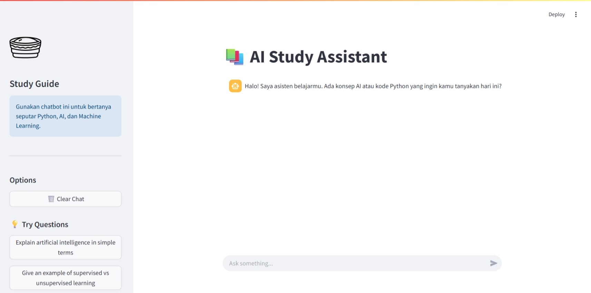
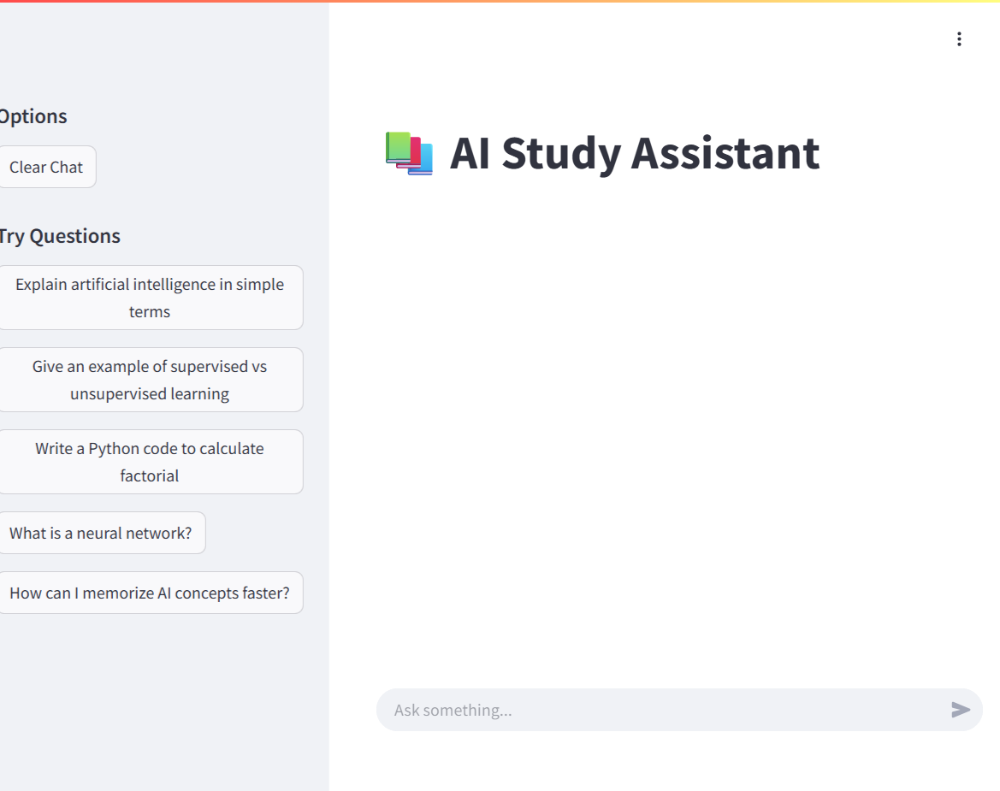
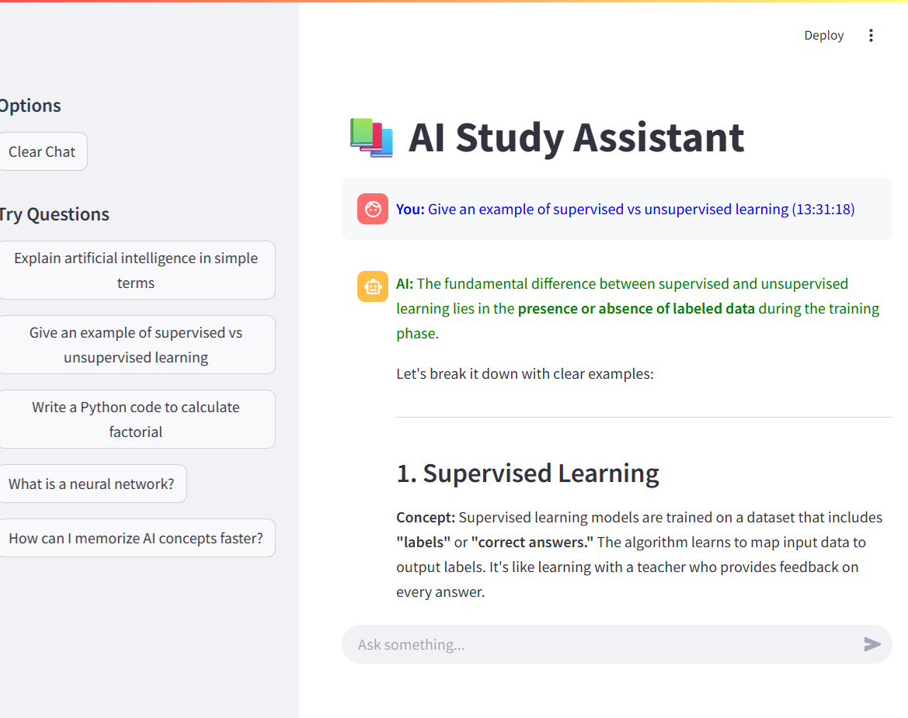
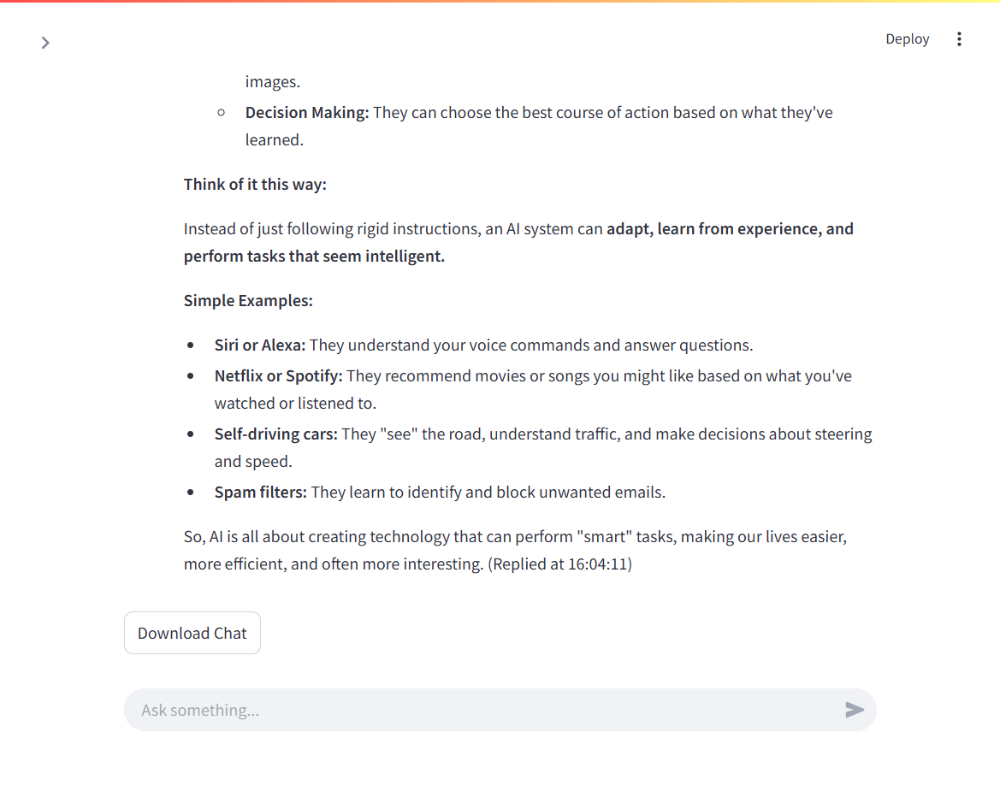

# 📚 AI Study Assistant

**AI Study Assistant** adalah chatbot berbasis AI yang dirancang untuk membantu mahasiswa atau pelajar belajar konsep Artificial Intelligence (AI) dan programming secara interaktif. Chatbot ini menggunakan model AI untuk memproses bahasa alami dan memberikan jawaban yang relevan dan mudah dipahami.

---

## 🎯 Target Pengguna

- Mahasiswa, pelajar, dan siapa pun yang ingin belajar AI secara cepat.
- Pengguna yang ingin contoh kode Python langsung dari chatbot.
- Pengguna yang ingin menyimpan percakapan belajar untuk review.

---

## 💡 Fitur Chatbot

- Menjawab pertanyaan seputar AI dengan bahasa yang sederhana.
- Memberikan contoh kode Python untuk latihan.
- Menyediakan tombol **Try Questions** untuk mempermudah eksplorasi pertanyaan.
- Menyimpan chat history menggunakan session memory.
- Download chat history untuk review materi belajar.
- Tampilan interaktif dengan spinner dan timestamp jawaban AI.

---

## 🛠️ Cara Menjalankan Project

### Frontend

1. Masuk ke folder frontend:

```bash
cd frontend
```

2. Install dependencies (jika belum):

```bash
pip install streamlit requests
```

3. pip install streamlit requests

```bash
streamlit run app.py
```

4. Akses aplikasi di browser, biasanya otomatis terbuka di: http://localhost:8501

# Backend

- Backend sudah dideploy di Vercel:

```bash
https://aura-backend-livid.vercel.app/api
```

- Frontend langsung memanggil URL tersebut, sehingga tidak perlu menjalankan backend lokal.

---

# 🖼️ Screenshot UI

1. Halaman utama chatbot
   | Chat Interface | Sidebar & Features |
   | :--- | :--- |
   |  |  |

2. Contoh pertanyaan & jawaban AI
   | Chat Interface | Sidebar & Features |
   | :--- | :--- |
   |  |  |

3. Sidebar Example Questions
   | Chat Interface | Sidebar & Features |
   | :--- | :--- |
   |  |  |

4. Download Chat History
   | Chat Interface | Sidebar & Features |
   | :--- | :--- |
   |  |  |

---

# 📁 Struktur Project

```bash
ai-study-assistant/
│
├─ backend/
│   ├─ main.py
│   ├─ chatbot.py
│
├─ frontend/
│   ├─ app.py
│
├─ README.md
└─ requirements.txt
```

---

# 🔗 Link GitHub

```bash
https://github.com/bayufrassetyo/ai-study-assistant
```

---

# ✅ Catatan

- Project ini sudah menggunakan backend di Vercel, sehingga tidak memerlukan .env.
- Frontend menggunakan Streamlit untuk UI interaktif.
- Semua chat disimpan sementara di session memory dan bisa di-download untuk review.
